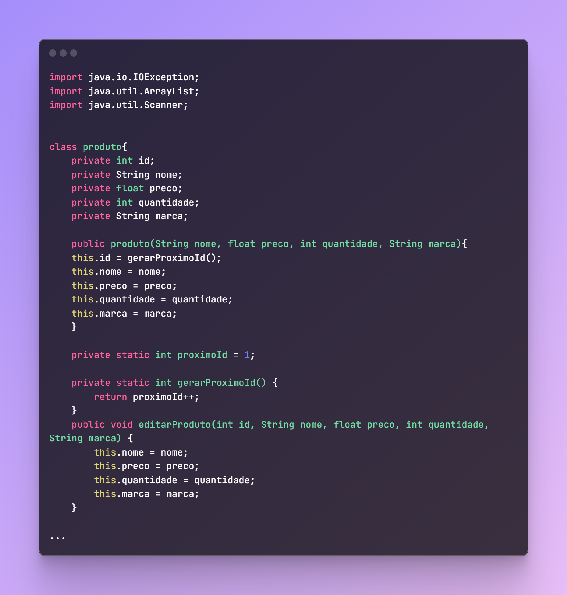
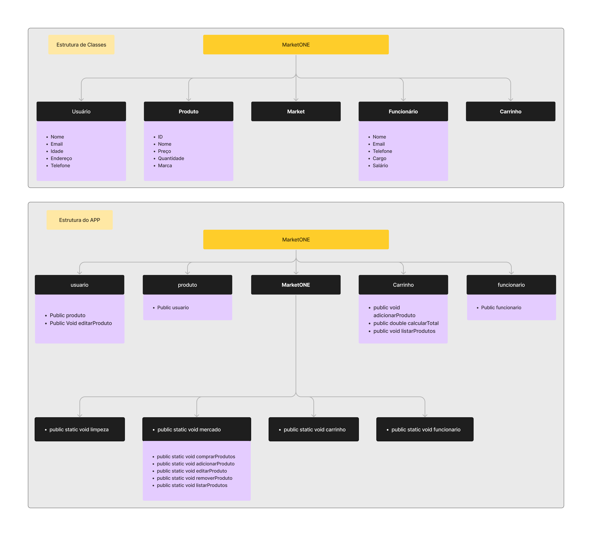

<h1 align="center"># MarketONE-UNIFACOL</h1>

<h2 align="center">
This repository contains a code for a <a href="MarketONE.java">Market system implemented in JAVA</a> as part of a project for my 🏫college
Has 2 versions:
  -Full Version (901 lines)
  -Lite Version ()
</h2>

  <h1>💻Code</h1>
  <h3>🔥<a href="MarketONE.java">Full version of the project</a></h3>
  <h3>💧<a href="StoreONE.java">Lite version of the project</a></h3>

 
 

  <h1>🧮Diagrams</h1>
  <h3>Full version</h3>
  <h3></h3>

