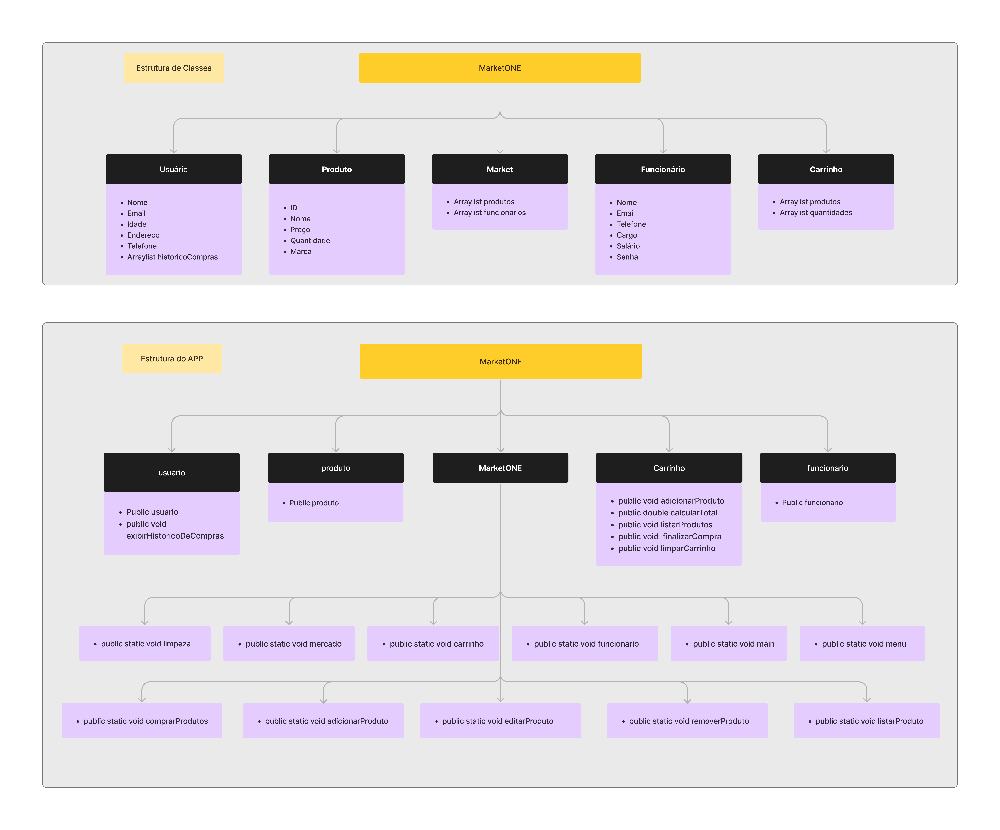

<div align="center" text-align="center">
    
    <br>
    <p>
    <a href="https://github.com/brunoliratm/MarketONE-Facol">
        
        
    </a>
    </p>
    <br>
    This repository contains the source code for MarketONE, a market system implemented in Java as part of a 🏫college project at UNIFACOL.
</div>
<br>
<br>

## 💻 Project Overview

MarketONE is a Java-based application that simulates a comprehensive market system. It provides users with a user-friendly interface to perform various tasks, including:

- **Product Management:**
  - `addProduct`: Adding new products to the marketplace
  - `editProduct`: Editing existing product details
  - `removeProduct`: Removing products from the system
  - `listProducts`: Viewing a detailed list of all available products
- **Shopping Cart Functionality:**
  - `addToCart`: Adding products to the shopping cart
  - `removeFromCart`: Removing products from the shopping cart
  - `calculateTotal`: Calculating the total cost of items in the cart
  - `checkout`: Finalizing purchases
- **User Accounts:**
  - `createAccount`: Creating customer accounts
  - `manageAccount`: Managing customer accounts
  - `viewPurchaseHistory`: Tracking purchase history and order details
  - `login`: Providing secure login and password management

<br>

## 📂 Installation and Usage

**Prerequisites:**

* Java Development Kit (JDK) version 21 or above ([JDK Download](https://www.oracle.com/java/technologies/downloads/))

**Instructions:**

1. Clone this repository:
   ```bash
   git clone https://github.com/brunoliratm/MarketONE-Facol.git
   ```
2. Navigate to the project directory:
   ```bash
   cd MarketONE-UNIFACOL
   ```
3. Compile the project:
   ```bash
   javac Main.java
   ```
4. Execute the main class:
   ```bash
   java -cp Main
   ```
<br>

## 🧮 Diagram

<details>
  <summary>Application Diagram</summary>


</details>
<br>

## 🤝 Contributing
If you'd like to contribute to this project, feel free to:

- Fork the repository.
- Create a new branch for your changes.
- Implement your modifications.
- Submit a pull request for review.
<br>

## ⚖️ License

This project is licensed under the [MIT License](LICENSE).


