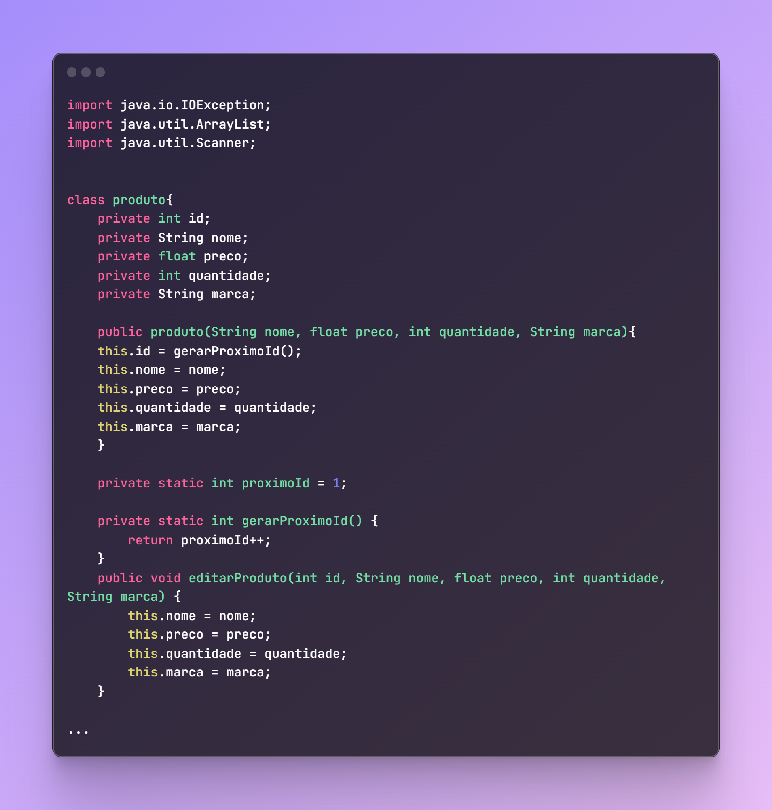
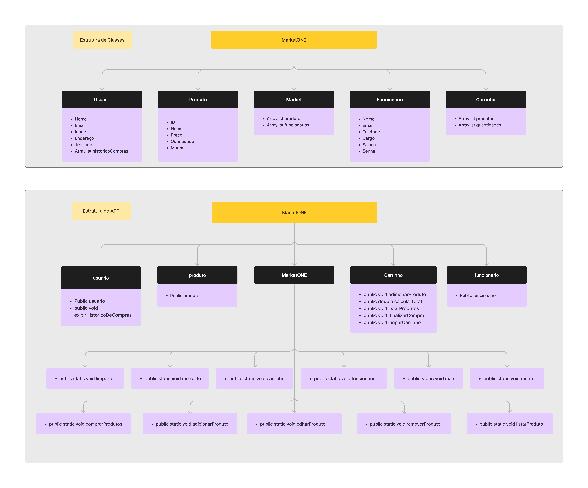
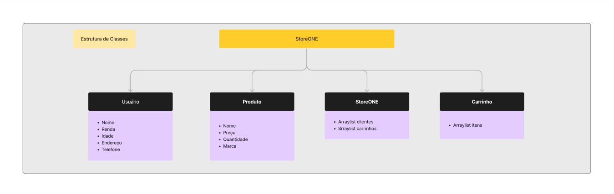

<h1 align="center"># MarketONE-UNIFACOL</h1>

<h2 align="center">
This repository contains a code for a <a href="MarketONE.java">Market system implemented in JAVA</a> as part of a project for my 🏫college
</h2>

<strong>The code has 2 versions: 
  -🔥Full Version (901 lines) 
  -💧Lite Version (311 lines)</strong>

  <h1>💻Code</h1>
  <h3>🔥<a href="MarketONE.java">Full version of the project</a></h3>

 
 

  <h1>🧮Diagrams</h1>
  <h2>Full version</h2>
  
   
   
  <h2>Lite version</h2>
  

